今天是2019-02-23日，记录下这个时间，看下作为一个普通大学生几个月（很好，就是几个月）能写出一个操作系统。

现在在大三下写操作系统的目的是为了能够省去小学期的时间，看下能否出去找个实习。而且大三上正好也学了才操作系统，做了ucore的实验，对操作系统有初步的了解，所以算是进一步了解操作系统这个庞然大物。

由于小学期的操作系统是参考的《30天自制操作系统》，所以直接参考这本书进行学习，原本想仿照64位的系统，但无法，查了些资料，还有建议看看《深入理解linux内核》。


## 第一天 从搞计算机结构到汇编程序入门

完整看完第一天的东西之后，发现一些有趣的事情。一开始作者想叫我们手打个helloos.img，我打了一下发现比较耗时间。所以去找作者提供的东西了。找到了一个[github](https://github.com/yourtion/30dayMakeOS) ，里面的tolset文件夹，有很多有用的工具。可以用作者自己做的nask.exe去生成img，不用自己打。将前面的下的github文件里的tolset\z_tools的nask.exe复制到01_day里，运行

```bash
nask helloos.nas helloos.img
```

就可以生成了这个img了

然后在tolset文件夹新建一个day1，把01_day里的东西都复制进去，然后运行run.bat，可以看到。

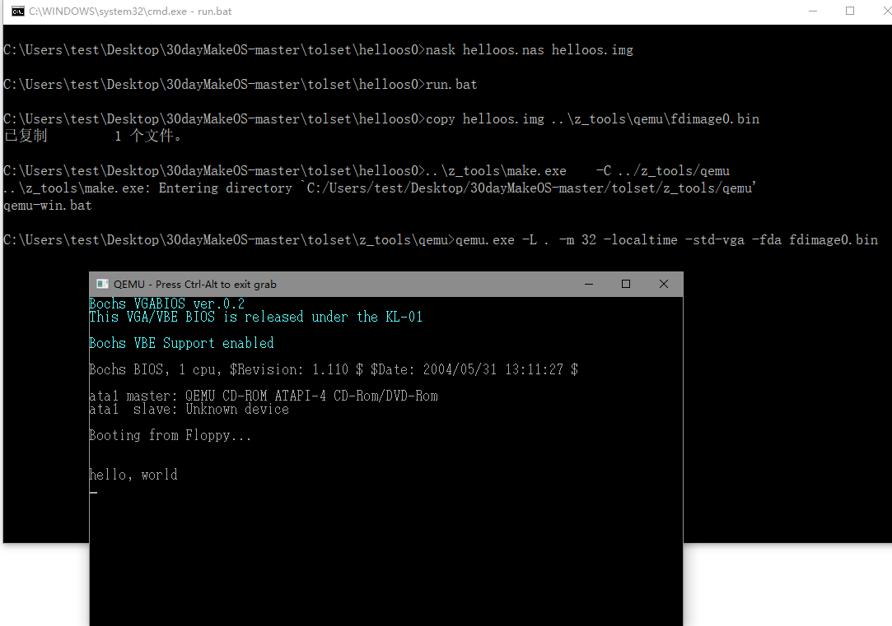

这样就算完成第一天的工作了。nas里面的代码的研究应该是放在后面。

这里值得一提的是，作者一开始说的是需要一个软盘，用install.bat装入到软盘里，然后在拿u盘启动系统。事实上这是十分麻烦的事情，而且还要32位的系统，所以一开始还试了一堆奇奇怪怪的方式，用阿里云装了个winser 2008 32位的系统，不行，然后就用VM装了个win7 32位，后来就发现后面用了qemu，在本机试了一下可以直接run.bat，不需要32位系统，或许后面需要，当备用。qemu在ucore实验也用了，真的是十分好用的一个东西。

## 第二天 汇编语言学习与Makefile入门

第二天主要讲了几个汇编指令、修改nas文件和Makefile的制作

ipl.nas里面的内容的前半部分是helloos.nas的前半部分

```
		ORG		0x7c00			; 指明程序装载地址
```

这里作者这讲了为什么是程序的装载地址是0x7c00,因为这是以前的开发者规定的0x00007c00-0x00007dff是启动区的内容装载地址。

```
entry:
		MOV		AX,0			; 初始化寄存器
		MOV		SS,AX
		MOV		SP,0x7c00
		MOV		DS,AX
		MOV		ES,AX
```

entry部分就是初始化寄存器，让AX SS DS ES=0，SP=0x7c00，sp是stack pointer寄存器，大概是放程序片的吧。

```
putloop:
		MOV		AL,[SI]
		ADD		SI,1			; 给SI加1
		CMP		AL,0
		JE		fin
		MOV		AH,0x0e			; 显示一个文字
		MOV		BX,15			; 指定字符颜色
		INT		0x10			; 调用显卡BIOS
		JMP		putloop
```

putloop后面调用了INT 0x10,这个是显示字符的相关中断，书上有讲。而前面部分则是让AL不停的去[SI+1]里面取值，直到碰到结束符0。相当于一个for循环。做完这些让cpu进入fin，让cpu停止并等待指令。

```
fin:
		HLT						; 让CPU停止，等待指令
		JMP		fin				; 无限循环
```

中间讲了用bat去制作镜像，不过这个可以跳过，直接用Makefile。作者简单的讲了Makefile的用法，然后我是使用的时候遇到了问题，执行make run的时候出现
```
process_begin: CreateProcess((null), copy helloos.img ..\z_tools\qemu\fdimage0.bin, ...) failed.
make (e=2): 系统找不到指定的文件。
```


无法将制作好的img copy到qemu文件夹里，查找半天资料，发现一个和我[一样的](https://blog.csdn.net/KINGKINGlj/article/details/50502321)。虽然没有解决，但是里面的链接所研究的问题倒是值得一看。我的解决方法是，新建一个copy.bat，写入

```
copy helloos.img ..\z_tools\qemu\fdimage0.bin
```

然后修改Makefile的run参数里的copy(26行)

```
	copy helloos.img ..\z_tools\qemu\fdimage0.bin -> copy.bat
```

这样调用即可成功make run 

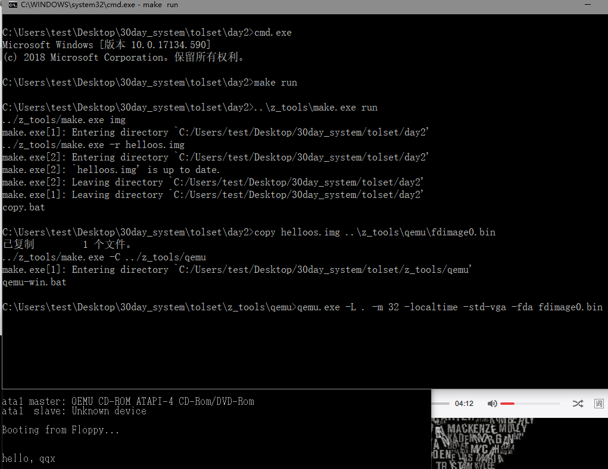

附上一些汇编常用寄存器
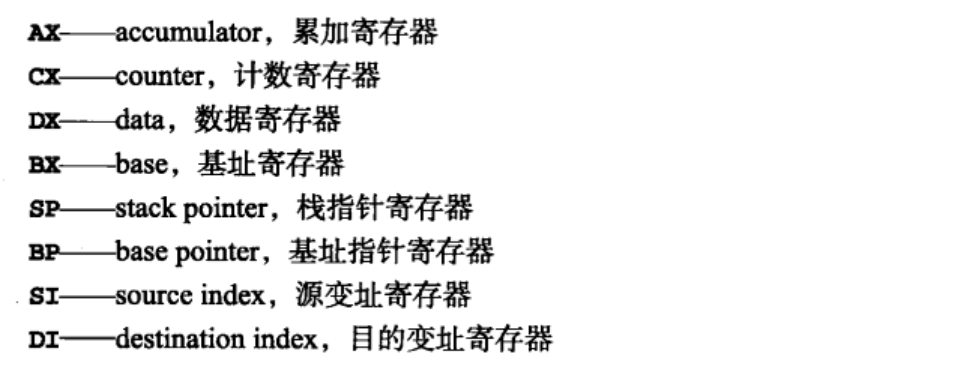


## 第三天 进入32位模式并导入C语言

​	第三天主要讲了用IPL装载程序，并用汇编对磁盘进行操作，同时处理报错，然后引入C语言。	

​	到这里，才发现其实我并不知道IPL是什么东西，所以需要去了解一下。本书第一天的内容有讲到

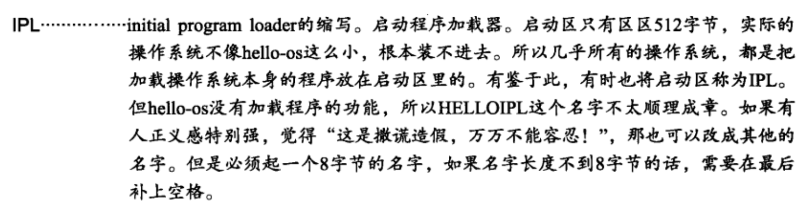

以及[CSDN博客](https://blog.csdn.net/jackli8431/article/details/51015020)中提到的，在MBR分区中，启动区只有512字节，所以不可能放整个程序进去，所以就放个IPL进去，然后通过IPL加载操作系统。

​	主要新增的汇编代码有

```
; 读取磁盘

		MOV		AX,0x0820
		MOV		ES,AX
		MOV		CH,0			; 柱面0
		MOV		DH,0			; 磁头0
		MOV		CL,2			; 扇区2

readloop:
		MOV		SI,0			; 记录失败次数寄存器

retry:
		MOV		AH,0x02			; AH=0x02 : 读入磁盘
		MOV		AL,1			; 1个扇区
		MOV		BX,0
		MOV		DL,0x00			; A驱动器		INT		0x13			; 调用磁盘BIOS
		JNC		next			; 没出错则跳转到fin
		ADD		SI,1			; 往SI加1
		CMP		SI,5			; 比较SI与5
		JAE		error			; SI >= 5 跳转到error
		MOV		AH,0x00
		MOV		DL,0x00			; A驱动器
		INT		0x13			; 重置驱动器
		JMP		retry
```

这里主要是调用INT 0x13来对磁盘进行操作，下面是一些参数的解释

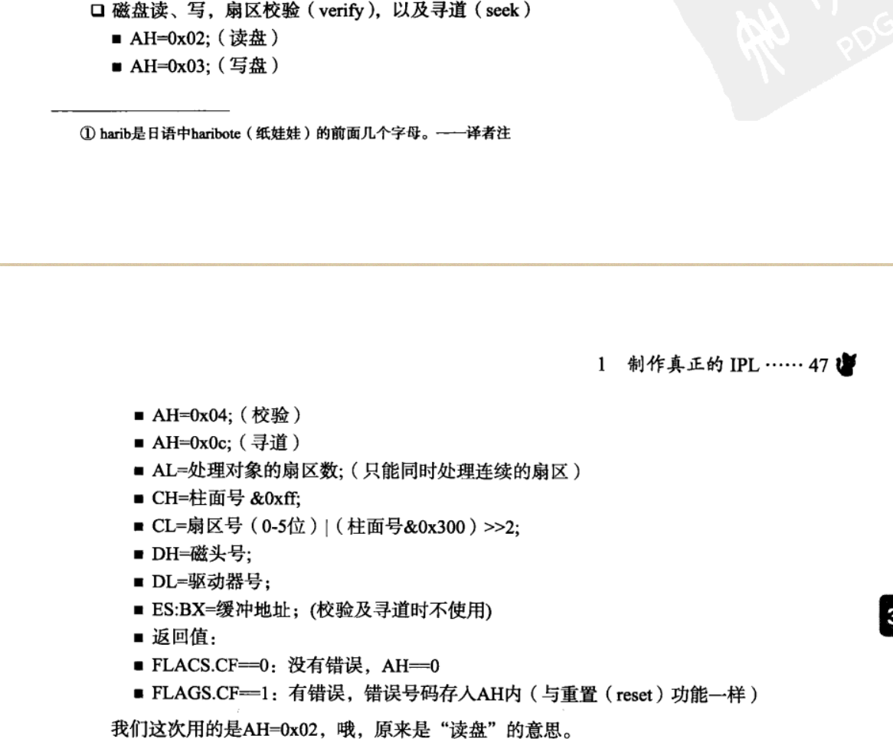

之所以要加载这个位置是因为IPL在这里

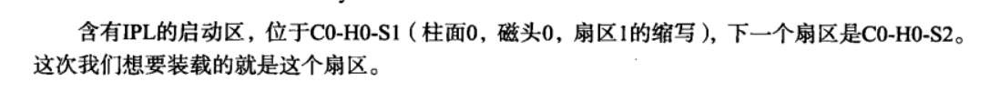

后面的内容有点奇怪，对于haribote.nas的内容不是很能理解，以及讲了bootpack.c，如何用作者改的cc1编译器将.c文件变成汇编文件，然后会汇编实现了HLT语句。

最后运行make run，还是会出现copy的错误，还是用上文第二天的方法解决即可，还有将del换成了rm，因为我的cmd环境有装bash，所以也可以make clean，要不然有点不爽。运行出来确实是黑屏，还以为失败了。

## 第四天 C语言与画面显示的练习

第四天最主要讲了C语言的指针、io_in、io_out以及中断EFLAGS。

```c
eflags = io_load_eflags();	/* 记录中断许可标志的值 */
io_cli(); 					/* 将中断许可标志置为0,禁止中断 */
io_store_eflags(eflags);	/* 复原中断许可标志 */
```

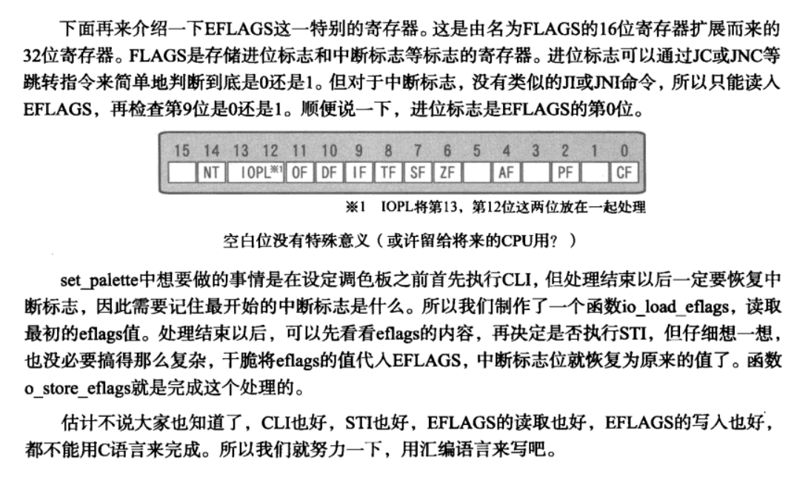

最后画出几个基本的图形，来结束第四天。

## 第五天 结构体、文字显示与GDT/IDT初始化

第五天接着第四天开始画数字和鼠标，代码中开始使用结构体。字体的描绘主要通过putblock8_8和putfont8来实现的，引入了hankaku的字体。鼠标是init_mouse_cursor8，同理也是通过16*16 ascii数组描绘出来的。最后则是GDT和IDT的初始化，书上有一定的介绍。

## 第六天 分割编译与中断处理

1. 分割大文件并使Makefile简化
   分割C文件后，如果有过个重复的定义，可以提取一个.h文件

   简化Makefile的方法是用通配符除去重复的行，形如

   %.gas : %.c Makefiile

   ​	\$(CC1) -o \$**.gas \$*.c

2. set_segmdesc函数的讲解
   这个函数主要讲了如何设置32位的段是怎么设置的。以及如何使段的上限变成4GB。

3. 初始化PIC
   PIC(programmable interrupt controller)是可编程中断控制器，是为了辅助CPU处理中断的。主要程序在init.c文件里。
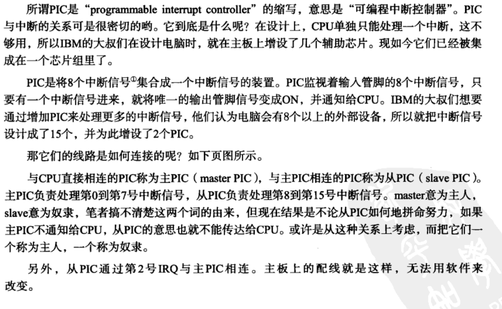
   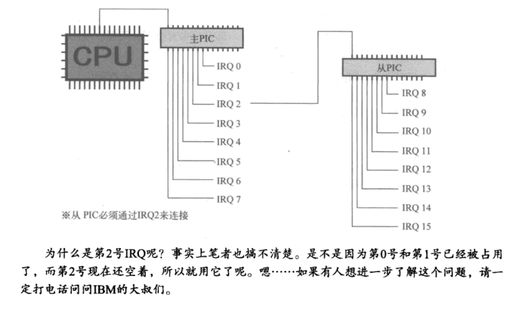
   
   ```c
   void init_pic(void)
   /* PIC初始化 */
   {
   	io_out8(PIC0_IMR,  0xff  ); /* 禁止所有中断 */
   	io_out8(PIC1_IMR,  0xff  ); /* 禁止所有中断 */
   
   	io_out8(PIC0_ICW1, 0x11  ); /* 边缘触发模式（edge trigger mode） */
   	io_out8(PIC0_ICW2, 0x20  ); /* IRQ0-7由INT20-27接收 */
   	io_out8(PIC0_ICW3, 1 << 2); /* PIC1由IRQ2相连 */
   	io_out8(PIC0_ICW4, 0x01  ); /* 无缓冲区模式 */
   
   	io_out8(PIC1_ICW1, 0x11  ); /* 边缘触发模式（edge trigger mode） */
   	io_out8(PIC1_ICW2, 0x28  ); /* IRQ8-15由INT28-2f接收 */
   	io_out8(PIC1_ICW3, 2     ); /* PIC1由IRQ2连接 */
   	io_out8(PIC1_ICW4, 0x01  ); /* 无缓冲区模式 */
   
   	io_out8(PIC0_IMR,  0xfb  ); /* 11111011 PIC1以外全部禁止 */
   	io_out8(PIC1_IMR,  0xff  ); /* 11111111 禁止所有中断 */
   
   	return;
   }
   ```
   
   
   
4. 处理鼠标中断

## 第七天 FIFO与鼠标控制

第七天的内容比较少。主要讲了处理鼠标中断和使用FIFO缓冲区来从鼠标获取数据、使用缓冲区的原因和改进缓冲区的数据结构。

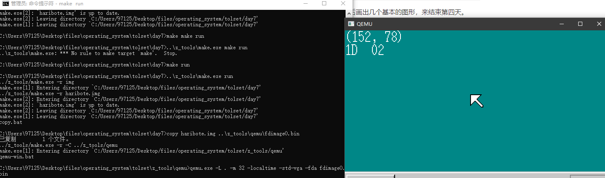


## 第八天 鼠标控制与32位模式切换

32位模式切换，在上学期的ucore实验中也有听过，但是没有深究，所以决定在这里了解一下。

首先维基一下什么是保护模式，与其对应的还有个实模式

> **保护模式**（英语：Protected Mode，或有时简写为 pmode）是一种80286系列和之后的x86兼容CPU的运行模式。保护模式有一些新的特性，如存储器保护，标签页系统以及硬件支持的**虚拟内存**，能够增强多任务处理和系统稳定度。现今大部分的x86操作系统都在保护模式下运行，包含Linux、FreeBSD、以及微软Windows 2.0和之后版本。
>
> 另外一种286和其之后CPU的运行模式是**实模式**，这是一种向前兼容且关闭了保护模式这些特性的CPU运行模式，用来让新的芯片可以运行旧的软件。所有的x86 CPU都是在实模式下引导，来确保传统操作系统的兼容性。为了使用保护模式的特性，要由程序主动地切换到保护模式。在现今的计算机上，这种切换通常是操作系统在引导时候完成的第一件任务。当CPU在保护模式下运行时，可以使用虚拟86模式来运行为实模式设计的代码。
>
> 尽管用软件的方式也有某些可能在实模式的系统下使用多任务，但保护模式下存储器保护的特色，可以避免有问题的程序破坏其他任务或是操作系统核心所拥有的存储器。保护模式也有中断正在运行程序的硬件支持，可以实现先占式多任务。
>
> 大部分可以使用保护模式的CPU也拥有32位寄存器的特性（例如80386系列和其后任何的芯片），导入了融合保护模式而成为32位处理的概念。80286芯片虽有支持保护模式，但是仍然只有16位寄存器。Windows 2.0和之后版本中的保护模式增强称为"386增强模式"，是因为他们除了保护模式外，还需要32位的寄存器，并且无法在286上面运行（即使286支持保护模式）。
>
> 即使在32位芯片上已经打开了保护模式，但是为了仿照IBM XT系统存储器连续的设计特性，1 MiB以上的存储器并无法访问。这种限制可以由打开A20总线来回避。
>
> 在保护模式下，前面32个中断都是保留给CPU异常处理用。例如，中断0D（十进制13）是一般保护模式错误，而中断00是除以零。
>
> 

还看到[博客](https://blog.csdn.net/jiary5201314/article/details/8091602)里的一段话

> 2.保护模式同实模式的根本区别是进程**内存受保护与否** 。可寻址空间的区别只是这一原因的果。 
>        实模式将整个物理内存看成分段的区域,程序代码和数据位于不同区域，系统程序和用户程序没有区别对待，而且每一个指针都是指向"实在"的物理地址。这样一来，用户程序的一个指针如果指向了系统程序区域或其他用户程序区域，并改变了值，那么对于这个被修改的系统程序或用户程序，其后果就很可能是灾难性的。为了克服这种低劣的内存管理方式，处理器厂商开发出保护模式。这样，物理内存地址不能直接被程序访问，程序内部的地址（虚拟地址）要由操作系统转化为物理地址去访问，程序对此一无所知。 至此，进程（这时我们可以称程序为进程了）有了严格的边界，任何其他进程根本没有办法访问不属于自己的物理内存区域，甚至在自己的虚拟地址范围内也不是可以任意访问的，因为有一些虚拟区域已经被放进一些公共系统运行库。这些区域也不能随便修改，若修改就会有: SIGSEGV（linux 段错误）;非法内存访问对话框（windows 对话框）。

代码如下：
```

;	切换到保护模式

[INSTRSET "i486p"]				; 说明使用486指令

		LGDT	[GDTR0]			; 设置临时GDT
		MOV		EAX,CR0
		AND		EAX,0x7fffffff	; 设bit31为0（禁用分页）
		OR		EAX,0x00000001	; bit0到1转换（保护模式过渡）
		MOV		CR0,EAX
		JMP		pipelineflush
pipelineflush:
		MOV		AX,1*8			;  可读写的段 32bit
		MOV		DS,AX
		MOV		ES,AX
		MOV		FS,AX
		MOV		GS,AX
		MOV		SS,AX
```

书上的解释

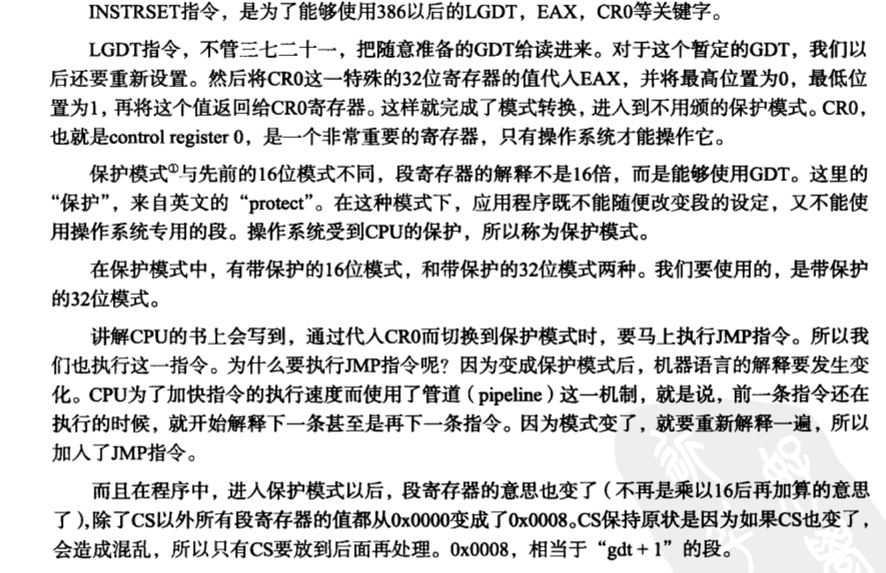


## 第九天 内存管理

本章主要讲了内存容量的检查，作者提到了可以用读BIOS去读内存的大小，但是不同的BIOS有不同的处理，所以还是用代码去读。

首先要区分是386还是486，因为386没有高速缓存，而486有，所以要对486禁用高速缓存。代码如下

```c
#define EFLAGS_AC_BIT			0x00040000
#define CR0_CACHE_DISABLE	0x60000000
unsigned int memtest(unsigned int start, unsigned int end) 
{
	char flg486 = 0;
	unsigned int eflg, cr0, i;

	/* 确认CPU是386还是486以上的 */
	eflg = io_load_eflags();
	eflg |= EFLAGS_AC_BIT; /* AC-bit = 1 */
	io_store_eflags(eflg);
	eflg = io_load_eflags();
	if ((eflg & EFLAGS_AC_BIT) != 0) {
		/* 如果是386，即使设定AC=1，AC的值还会自动回到0 */
		flg486 = 1;
	}

	eflg &= ~EFLAGS_AC_BIT; /* AC-bit = 0 */
	io_store_eflags(eflg);

	if (flg486 != 0) {
		cr0 = load_cr0();
		cr0 |= CR0_CACHE_DISABLE; /* 禁止缓存 */ 
		store_cr0(cr0);
	}

	i = memtest_sub(start, end);

	if (flg486 != 0) {
		cr0 = load_cr0();
		cr0 &= ~CR0_CACHE_DISABLE; /* 允许缓存 */
		store_cr0(cr0);
	}

	return i;
}
```

解释如下图

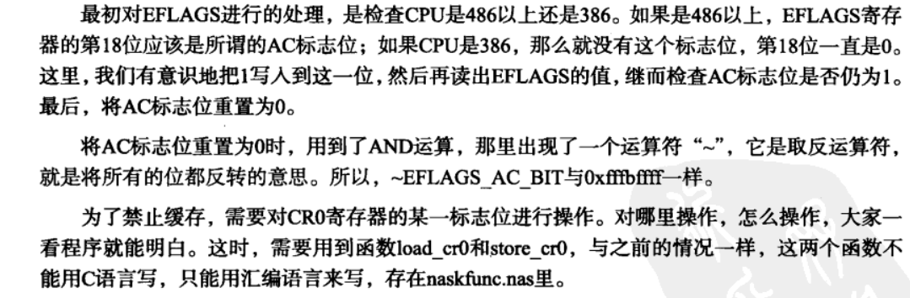

load_cr0和store_cr0用汇编写

memtest_sub是检查内存的函数，因为编译器优化的问题，所以作者也用汇编实现了。

接下来是内存管理，主要是内存分配和内存释放。在ucore和操作系统的书里也有讲过，作者用的是用一个memory manager去记录哪块是free的，然后分配即可，然后释放的时候也是标记frees,并释放。

运行结果

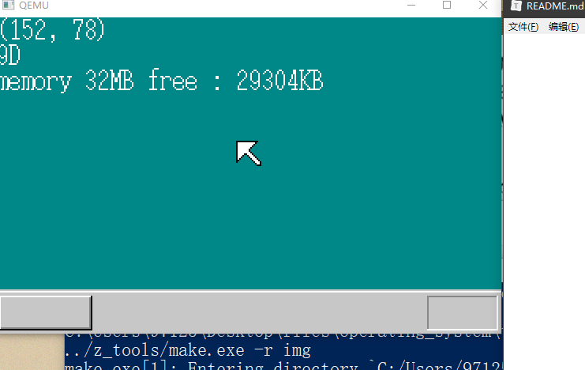

##  第十天 叠加处理

本章继续讲了内存管理，因为之前的处理在释放内存的时候没处理剩下的小块内存，所以加上了处理。然后开始窗口的叠加处理，使用图层的思想。

创建了一个图层结构体和图层管理结构体

```c
/* sheet.c */
#define MAX_SHEETS		256
#define SHEET_USE  1

struct SHEET {
	unsigned char *buf;
	int bxsize, bysize, vx0, vy0, col_inv, height, flags;
};

struct SHTCTL {
	unsigned char *vram;
	int xsize, ysize, top;
	struct SHEET *sheets[MAX_SHEETS];
	struct SHEET sheets0[MAX_SHEETS];
};

struct SHTCTL *shtctl_init(struct MEMMAN *memman, unsigned char *vram, int xsize, int ysize);
struct SHEET *sheet_alloc(struct SHTCTL *ctl);
void sheet_setbuf(struct SHEET *sht, unsigned char *buf, int xsize, int ysize, int col_inv);
void sheet_updown(struct SHTCTL *ctl, struct SHEET *sht, int height);
void sheet_refresh(struct SHTCTL *ctl, struct SHEET *sht, int bx0, int by0, int bx1, int by1);
void sheet_slide(struct SHTCTL *ctl, struct SHEET *sht, int vx0, int vy0);
void sheet_free(struct SHTCTL *ctl, struct SHEET *sht);
```

后面两小节以提高叠加速度为主，之前是每次移动都会刷新整个页面，所以速度会很慢，所以要改成需要刷新的部分即可。


## 第十一天 制作窗口

第一节，第二节引入鼠标移动到左右边界出现的问题，并解决移动到画面外的问题。

第四节开始尝试制作其它窗口，就像鼠标和背景一样。然后在做高速计数器和消除闪烁，用一个map去区分哪些用刷新哪些不用刷新。


## 第十二天 定时器

第一节做定时器，定时器对CPU十分重要

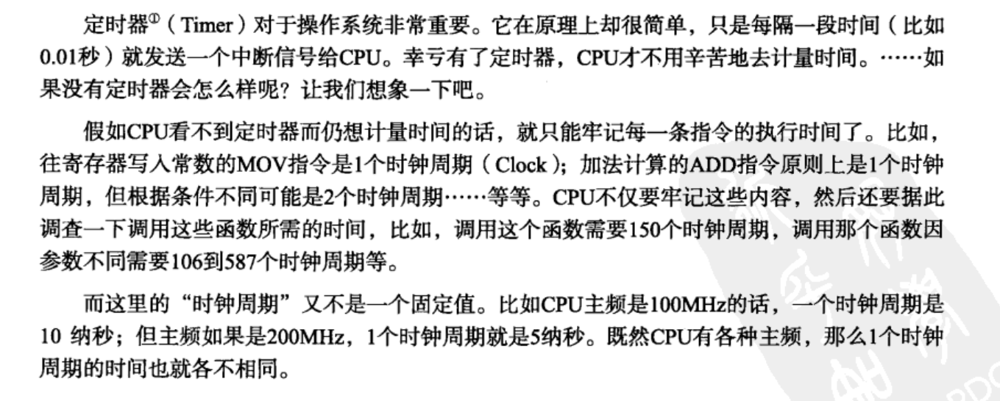

在电脑中管理定时器，只需要对PIT进行设定就可以了，让定时器每隔多少s就产生中断。函数的编写和原理

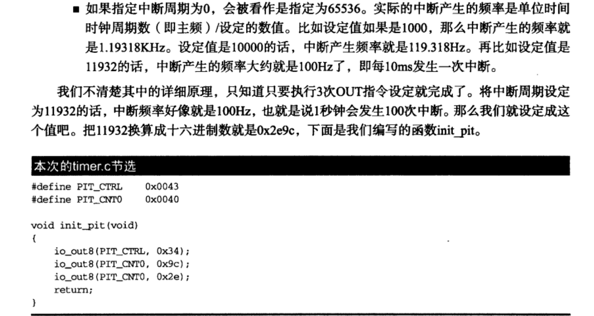

“泡乌冬面时可以拿它计时”

## 第十三天 定时器

本章节也主要是一些简单的工作

1. 简化字符串
2. 重新调整FIFO缓冲区
3. 再次加快中断处理
4. 使用“哨兵”简化程序

## 第十四天 高分辨率及键盘输入

1. 提高分辨率
   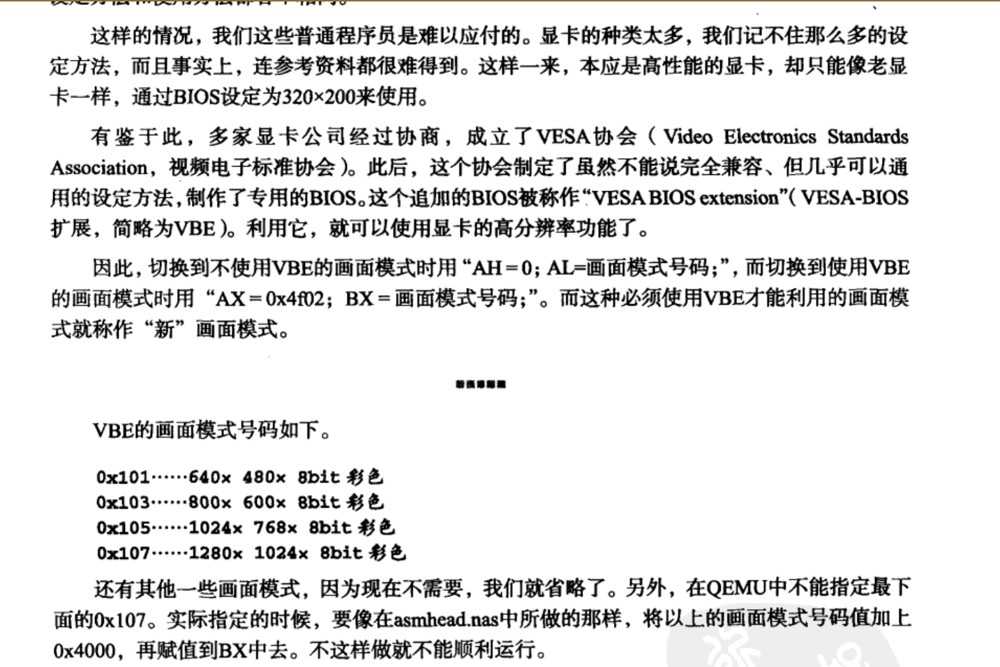

2. 在真机上提高分辨率
   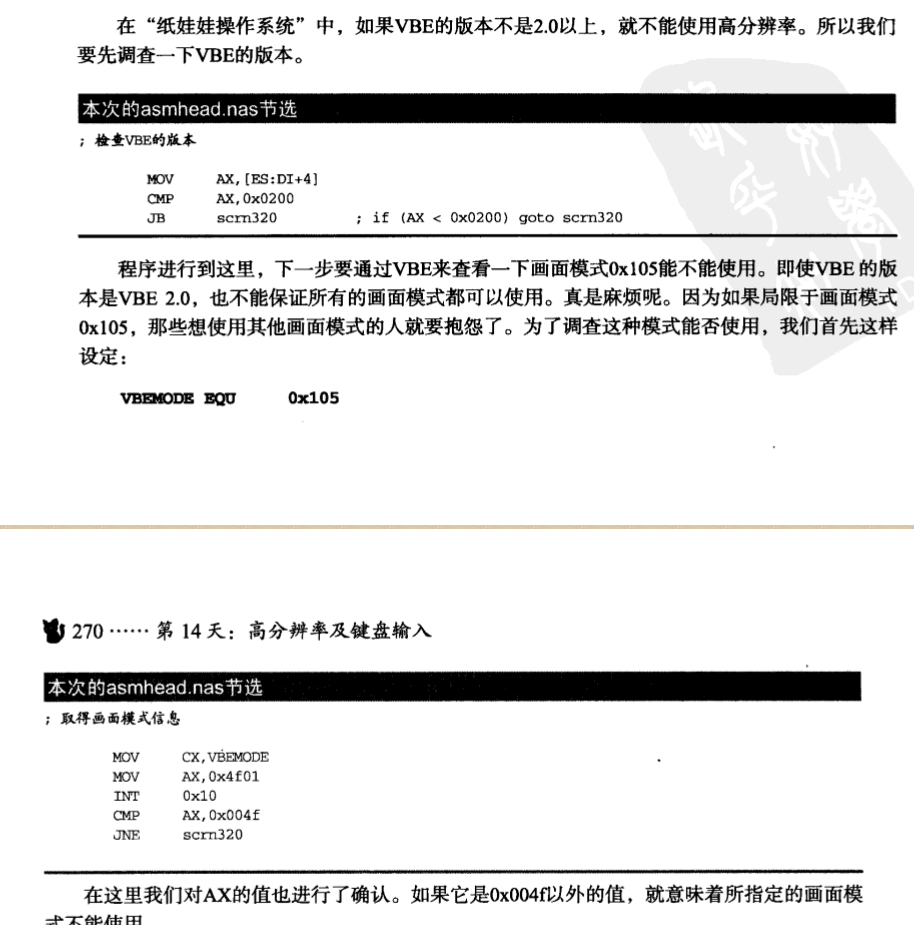


   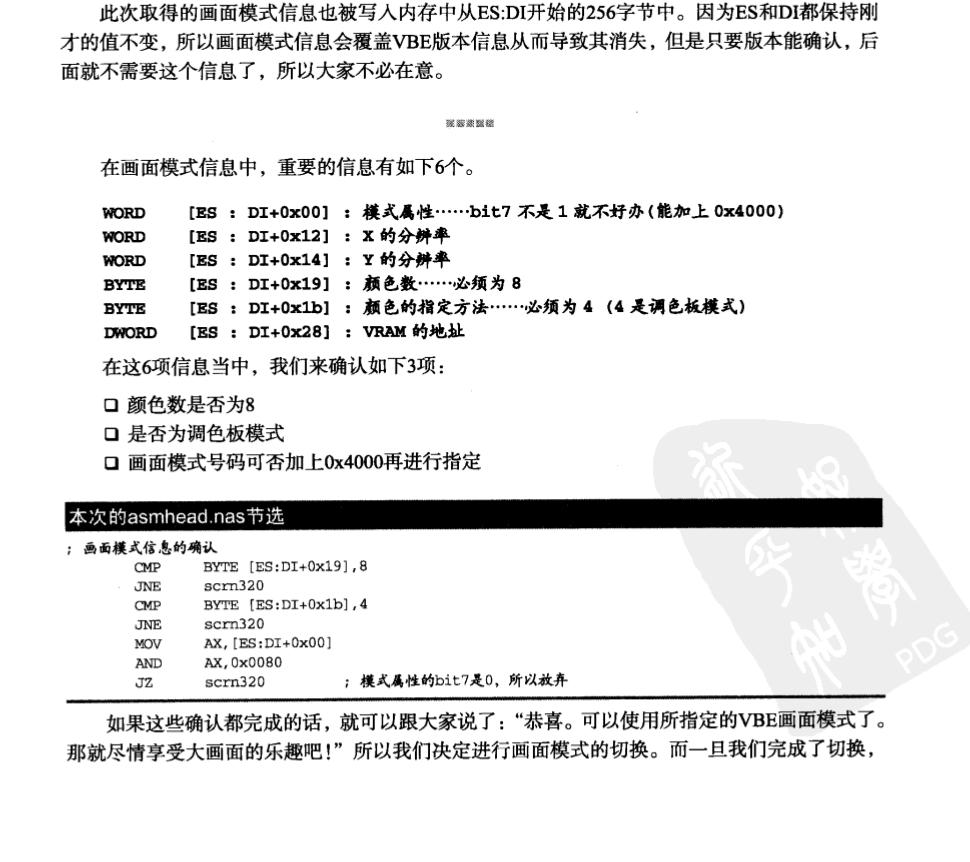

   接下来大概是处理键盘的输入显示在屏幕上，按下和弹起都有对应的值，需要一张对应表。


## 第15天 多任务（1）

1. 挑战多任务
2. 任务切换进阶
3. 做个简单的多任务
4. 提高运行速度及测试
5. 多任务进阶

实现多任务，不可避免的要说到上下文切换和进程调度。本章首先介绍了任务状态段(TSS)

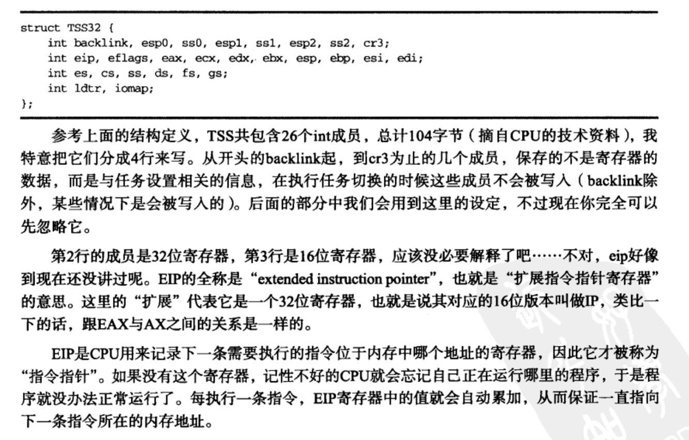

任务切换要用到JMP指令，JMP指令分为两种,

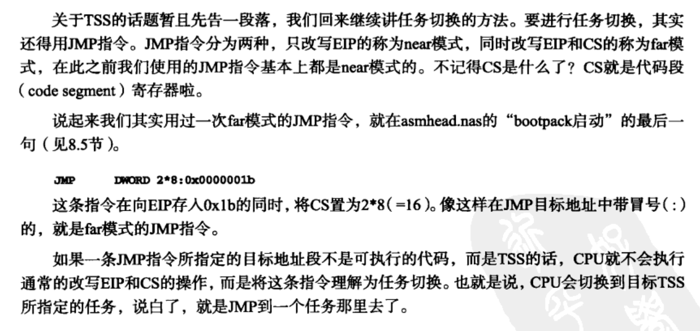

```c
#include "bootpack.h"

struct TIMER *mt_timer;
int mt_tr;

void mt_init(void)
{
	mt_timer = timer_alloc();
	/*这里没有必要使用timer_init */
	timer_settime(mt_timer, 2);
	mt_tr = 3 * 8;
	return;
}

void mt_taskswitch(void)
{
	if (mt_tr == 3 * 8) {
		mt_tr = 4 * 8;
	} else {
		mt_tr = 3 * 8;
	}
	timer_settime(mt_timer, 2);
	farjmp(0, mt_tr);
	return;
}
```


## 第十六天 多任务(2)

1. 任务管理自动化

   上一天的任务管理是手动切换，比如当任务是3时切换到4，是4切换到3。所以需要升级成自动管理的样子。

   基本的任务数据结构

   ```c
   /* mtask.c */
   #define MAX_TASKS 1000	/*最大任务数量*/
   #define TASK_GDT0 3			/*定义从GDT的几号开始分配给TSS */
   #define MAX_TASKS_LV    100
   #define MAX_TASKLEVELS  10
   struct TSS32 {
   	int backlink, esp0, ss0, esp1, ss1, esp2, ss2, cr3;
   	int eip, eflags, eax, ecx, edx, ebx, esp, ebp, esi, edi;
   	int es, cs, ss, ds, fs, gs;
   	int ldtr, iomap;
   };
   
   struct TASK {
   	int sel, flags;		/* sel用来存放GDT的编号*/
   	int level, priority; /* 优先级 */
   	struct TSS32 tss;
   };
   
   struct TASKCTL {
   	int now_lv; /*现在活动中的LEVEL */
   	char lv_change; /*在下次任务切换时是否需要改变LEVEL */
   	struct TASKLEVEL level[MAX_TASKLEVELS];
   	struct TASK tasks0[MAX_TASKS];
   };
   ```

   任务初始化

   ```c
   struct TASK *task_init(struct MEMMAN *memman)
   {
   	int i;
   	struct TASK *task;
   	struct SEGMENT_DESCRIPTOR *gdt = (struct SEGMENT_DESCRIPTOR *) ADR_GDT;
   	taskctl = (struct TASKCTL *) memman_alloc_4k(memman, sizeof (struct TASKCTL));
   
   	for (i = 0; i < MAX_TASKS; i++) {
   		taskctl->tasks0[i].flags = 0;
   		taskctl->tasks0[i].sel = (TASK_GDT0 + i) * 8;
   		set_segmdesc(gdt + TASK_GDT0 + i, 103, (int) &taskctl->tasks0[i].tss, AR_TSS32);
   	}
   	for (i = 0; i < MAX_TASKLEVELS; i++) {
   		taskctl->level[i].running = 0;
   		taskctl->level[i].now = 0;
   	}
   	task = task_alloc();
   	task->flags = 2; /*活动中标志*/
   	task->priority = 2; /* 0.02秒*/
   	task->level = 0; /*最高LEVEL */
   	task_add(task);
   	task_switchsub(); /* LEVEL 设置*/
   	load_tr(task->sel);
   	task_timer = timer_alloc();
   	timer_settime(task_timer, task->priority);
   	return task;
   }
   ```

   任务分配

   ```c
   struct TASK *task_alloc(void)
   {
   	int i;
   	struct TASK *task;
   	for (i = 0; i < MAX_TASKS; i++) {
   		if (taskctl->tasks0[i].flags == 0) {
   			task = &taskctl->tasks0[i];
   			task->flags = 1;   /*正在使用的标志*/
   			task->tss.eflags = 0x00000202; /* IF = 1; */
   			task->tss.eax = 0; /*这里先置为0*/
   			task->tss.ecx = 0;
   			task->tss.edx = 0;
   			task->tss.ebx = 0;
   			task->tss.ebp = 0;
   			task->tss.esi = 0;
   			task->tss.edi = 0;
   			task->tss.es = 0;
   			task->tss.ds = 0;
   			task->tss.fs = 0;
   			task->tss.gs = 0;
   			task->tss.ldtr = 0;
   			task->tss.iomap = 0x40000000;
   			return task;
   		}
   	}
   	return 0; /*全部正在使用*/
   }
   ```

   任务切换

   ```c
   void task_switch(void)
   {
   	struct TASKLEVEL *tl = &taskctl->level[taskctl->now_lv];
   	struct TASK *new_task, *now_task = tl->tasks[tl->now];
   	tl->now++;
   	if (tl->now == tl->running) {
   		tl->now = 0;
   	}
   	if (taskctl->lv_change != 0) {
   		task_switchsub();
   		tl = &taskctl->level[taskctl->now_lv];
   	}
   	new_task = tl->tasks[tl->now];
   	timer_settime(task_timer, new_task->priority);
   	if (new_task != now_task) {
   		farjmp(0, new_task->sel);
   	}
   	return;
   }
   ```

   

2. 让任务休眠和设定窗口优先级

   让任务休眠的主要做法是，让没有运行需求的任务从任务队列中剔除，如果有任务来，就唤醒它。这样做的目的是为了节约资源。

   ```c
   void task_sleep(struct TASK *task)
   {
   	struct TASK *now_task;
   	if (task->flags == 2) {
   		/*如果处于活动状态*/
   		now_task = task_now();
   		task_remove(task); /*执行此语句的话flags将变为1 */
   		if (task == now_task) {
   			/*如果是让自己休眠，则需要进行任务切换*/
   			task_switchsub();
   			now_task = task_now(); /*在设定后获取当前任务的值*/
   			farjmp(0, now_task->sel);
   		}
   	}
   	return;
   }
   
   ```

   ```c
   int fifo32_put(struct FIFO32 *fifo, int data)
   /*向FIFO写入数据并累积起来*/
   {
   	if (fifo->free == 0) {
   		/*没有空余空间，溢出*/
   		fifo->flags |= FLAGS_OVERRUN;
   		return -1;
   	}
   	fifo->buf[fifo->p] = data;
   	fifo->p++;
   	if (fifo->p == fifo->size) {
   		fifo->p = 0;
   	}
   	fifo->free--;
   	if (fifo->task != 0) {
   		if (fifo->task->flags != 2) { /*如果任务处于休眠状态*/
   			task_run(fifo->task, -1, 0); /*将任务唤醒*/
   		}
   	}
   	return 0;
   }
   ```

   ```c
   void task_run(struct TASK *task, int level, int priority)
   {
   	if (level < 0) {
   		level = task->level; /*不改变LEVEL */
   	}
   	if (priority > 0) {
   		task->priority = priority;
   	}
   	if (task->flags == 2 && task->level != level) { 
   		/*改变活动中的LEVEL */
   		task_remove(task); /*这里执行之后flag的值会变为1，于是下面的if语句块也会被执行*/
   	}
   	if (task->flags != 2) {
   		/*从休眠状态唤醒的情形*/
   		task->level = level;
   		task_add(task);
   	}
   	taskctl->lv_change = 1; /*下次任务切换时检查LEVEL */
   	return;
   }
   ```

   
