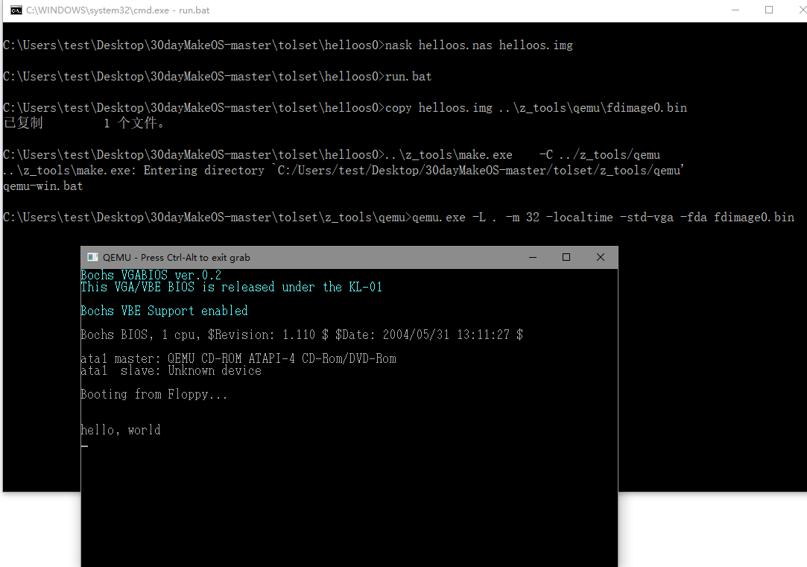
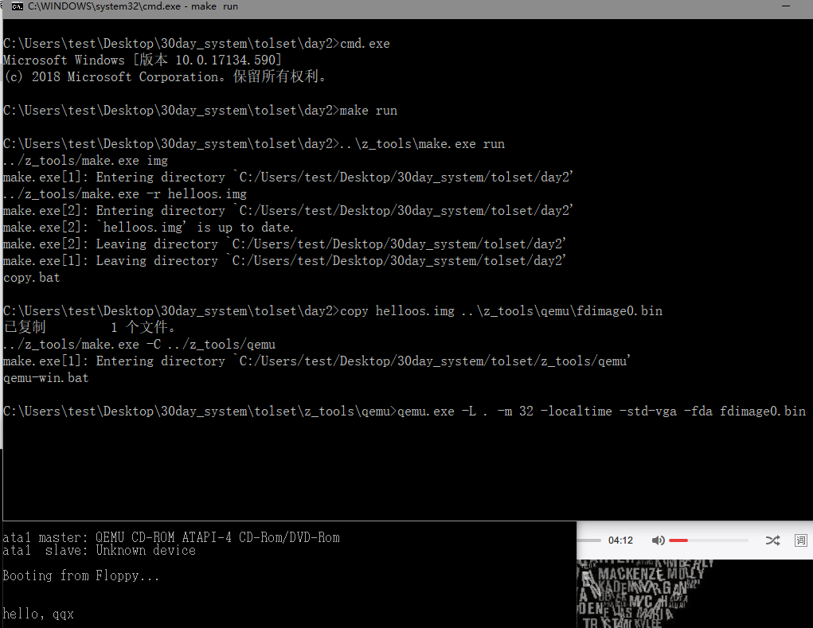
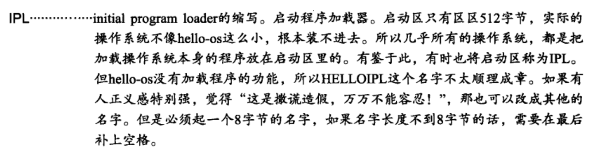
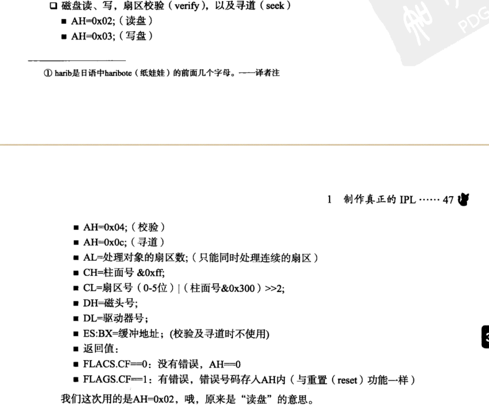
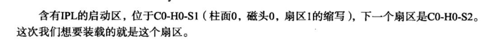

今天是2019-02-23日，记录下这个时间，看下作为一个普通大学生几个月能写出一个操作系统。

现在在大三下写操作系统的目的是为了能够省去小学期的时间，看下能否出去找个实习。而且大三上正好也学了才操作系统，做了ucore的实验，对操作系统有初步的了解，所以算是进一步了解操作系统这个庞然大物。

由于小学期的操作系统是参考的《30天自制操作系统》，所以直接参考这本书进行学习，原本想仿照64位的系统，但无法，查了些资料，还有建议看看《深入理解linux内核》。


## 第一天 从搞计算机结构到汇编程序入门

完整看完第一天的东西之后，发现一些有趣的事情。一开始作者想叫我们手打个helloos.img，我打了一下发现比较耗时间。所以去找作者提供的东西了。找到了一个[github](https://github.com/yourtion/30dayMakeOS) ，里面的tolset文件夹，有很多有用的工具。可以用作者自己做的nask.exe去生成img，不用自己打。将前面的下的github文件里的tolset\z_tools的nask.exe复制到01_day里，运行

```bash
nask helloos.nas helloos.img
```

就可以生成了这个img了

然后在tolset文件夹新建一个day1，把01_day里的东西都复制进去，然后运行run.bat，可以看到。



这样就算完成第一天的工作了。nas里面的代码的研究应该是放在后面。

这里值得一提的是，作者一开始说的是需要一个软盘，用install.bat装入到软盘里，然后在拿u盘启动系统。事实上这是十分麻烦的事情，而且还要32位的系统，所以一开始还试了一堆奇奇怪怪的方式，用阿里云装了个winser 2008 32位的系统，不行，然后就用VM装了个win7 32位，后来就发现后面用了qemu，在本机试了一下可以直接run.bat，不需要32位系统，或许后面需要，当备用。qemu在ucore实验也用了，真的是十分好用的一个东西。

## 第二天 汇编语言学习与Makefile入门

第二天主要讲了几个汇编指令、修改nas文件和Makefile的制作

ipl.nas里面的内容的前半部分是helloos.nas的前半部分

```
		ORG		0x7c00			; 指明程序装载地址
```

这里作者这讲了为什么是程序的装载地址是0x7c00,因为这是以前的开发者规定的0x00007c00-0x00007dff是启动区的内容装载地址。

```
entry:
		MOV		AX,0			; 初始化寄存器
		MOV		SS,AX
		MOV		SP,0x7c00
		MOV		DS,AX
		MOV		ES,AX
```

entry部分就是初始化寄存器，让AX SS DS ES=0，SP=0x7c00，sp是stack pointer寄存器，大概是放程序片的吧。

```
putloop:
		MOV		AL,[SI]
		ADD		SI,1			; 给SI加1
		CMP		AL,0
		JE		fin
		MOV		AH,0x0e			; 显示一个文字
		MOV		BX,15			; 指定字符颜色
		INT		0x10			; 调用显卡BIOS
		JMP		putloop
```

putloop后面调用了INT 0x10,这个是显示字符的相关中断，书上有讲。而前面部分则是让AL不停的去[SI+1]里面取值，直到碰到结束符0。相当于一个for循环。做完这些让cpu进入fin，让cpu停止并等待指令。

```
fin:
		HLT						; 让CPU停止，等待指令
		JMP		fin				; 无限循环
```

中间讲了用bat去制作镜像，不过这个可以跳过，直接用Makefile。作者简单的讲了Makefile的用法，然后我是使用的时候遇到了问题，执行make run的时候出现
```
process_begin: CreateProcess((null), copy helloos.img ..\z_tools\qemu\fdimage0.bin, ...) failed.
make (e=2): 系统找不到指定的文件。
```


无法将制作好的img copy到qemu文件夹里，查找半天资料，发现一个和我[一样的](https://blog.csdn.net/KINGKINGlj/article/details/50502321)。虽然没有解决，但是里面的链接所研究的问题倒是值得一看。我的解决方法是，新建一个copy.bat，写入

```
copy helloos.img ..\z_tools\qemu\fdimage0.bin
```

然后修改Makefile的run参数里的copy(26行)

```
	copy helloos.img ..\z_tools\qemu\fdimage0.bin -> copy.bat
```

这样调用即可成功make run 




## 第三天 进入32位模式并导入C语言

​	第三天主要讲了用IPL装载程序，并用汇编对磁盘进行操作，同时处理报错，然后引入C语言。	

​	到这里，才发现其实我并不知道IPL是什么东西，所以需要去了解一下。本书第一天的内容有讲到



以及[CSDN博客](https://blog.csdn.net/jackli8431/article/details/51015020)中提到的，在MBR分区中，启动区只有512字节，所以不可能放整个程序进去，所以就放个IPL进去，然后通过IPL加载操作系统。

​	主要新增的汇编代码有

```
; 读取磁盘

		MOV		AX,0x0820
		MOV		ES,AX
		MOV		CH,0			; 柱面0
		MOV		DH,0			; 磁头0
		MOV		CL,2			; 扇区2

readloop:
		MOV		SI,0			; 记录失败次数寄存器

retry:
		MOV		AH,0x02			; AH=0x02 : 读入磁盘
		MOV		AL,1			; 1个扇区
		MOV		BX,0
		MOV		DL,0x00			; A驱动器		INT		0x13			; 调用磁盘BIOS
		JNC		next			; 没出错则跳转到fin
		ADD		SI,1			; 往SI加1
		CMP		SI,5			; 比较SI与5
		JAE		error			; SI >= 5 跳转到error
		MOV		AH,0x00
		MOV		DL,0x00			; A驱动器
		INT		0x13			; 重置驱动器
		JMP		retry
```

这里主要是调用INT 0x13来对磁盘进行操作，下面是一些参数的解释



之所以要加载这个位置是因为IPL在这里



后面的内容有点奇怪，对于haribote.nas的内容不是很能理解，以及讲了bootpack.c，如何用作者改的cc1编译器将.c文件变成汇编文件，然后会汇编实现了HLT语句。

最后运行make run，还是会出现copy的错误，还是用上文第二天的方法解决即可，还有将del换成了rm，因为我的cmd环境有装bash，所以也可以make clean，要不然有点不爽。运行出来确实是黑屏，还以为失败了。

## 第四天 C语言与画面显示的练习

第四天最主要讲了C语言的指针、io_in、io_out以及中断EFLAGS。最后画出几个基本的图形，来结束第四天。

## 第五天 结构体、文字显示与GDT/IDT初始化

第五天接着第四天开始画数字和鼠标，代码中开始使用结构体。字体的描绘主要通过putblock8_8和putfont8来实现的，引入了hankaku的字体。鼠标是init_mouse_cursor8，同理也是通过16*16 ascii数组描绘出来的。最后则是GDT和IDT的初始化，书上有一定的介绍。

